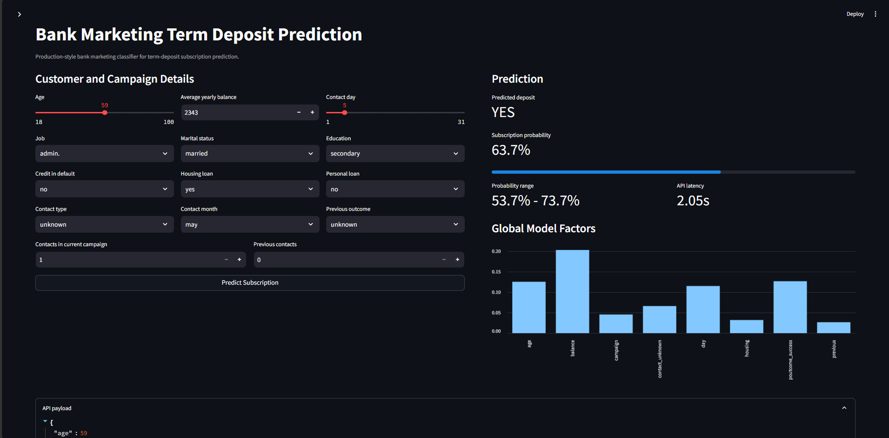
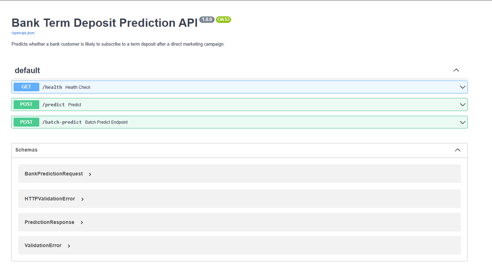
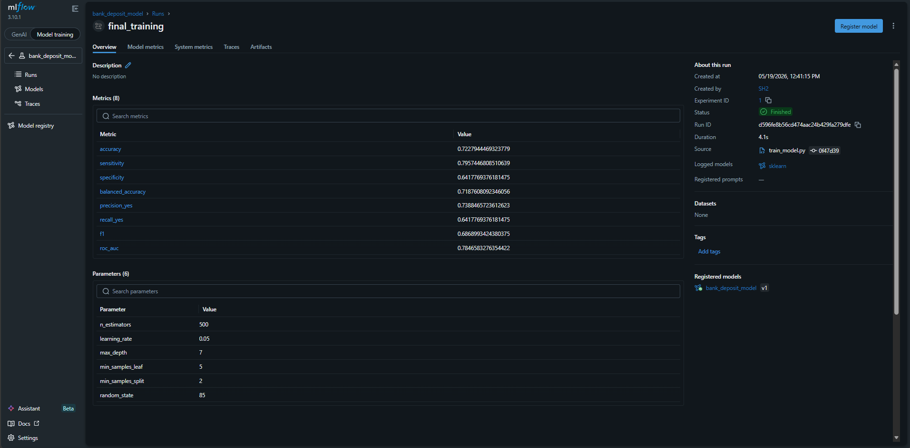
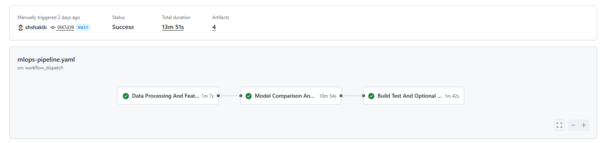
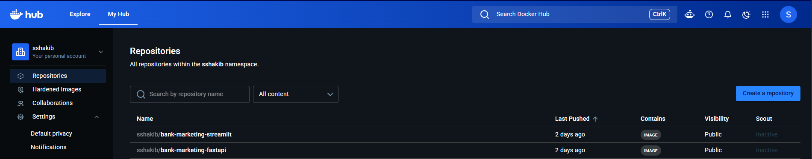

# Bank Marketing - Predicting Term Deposit Subscription

This project is an end-to-end MLOps workflow for a bank marketing classifier. It predicts whether a customer is likely to subscribe to a term deposit using the Bank Marketing dataset.

Here is the production feature set:

- Target: `deposit`
- Task: binary classification
- Excluded from prediction: `duration`, because it is only known after the call
- Excluded from prediction: `pdays`, because the `-1` value dominates and was treated as unreliable
- Default model: Gradient Boosting classifier
- Evaluation metrics: accuracy, precision, recall, specificity, balanced accuracy, F1, and ROC AUC
- Preprocessing: `default`, `housing`, and `loan` are label-encoded; other categorical fields use full-rank one-hot encoding
- Comparison: Random Forest, GBM, Logistic Regression, and LDA are evaluated both with and without `duration`

## Project Screenshots

The screenshots below highlight the main application interface, API layer, experiment tracking, automation workflow, and container publishing. 

### Streamlit Prediction Interface



### FastAPI API Documentation



### MLflow Experiment Tracking



### GitHub Actions Pipeline



### Docker Hub Images



## Project Structure

```text
.
|-- configs/                 # Model configuration
|-- data/
|   |-- raw/                 # bank.csv
|   `-- processed/           # cleaned and feature-engineered data
|-- docs/screenshots/        # Portfolio screenshots used in README
|-- deployment/
|   `-- mlflow/              # MLflow tracking server setup
|-- models/trained/          # Model, preprocessor, and metrics artifacts
|-- notebooks/               # Data science notebooks
|-- reports/figures/         # EDA figures
|-- src/
|   |-- api/                 # FastAPI model service
|   |-- data/                # Data cleaning pipeline
|   |-- features/            # Feature engineering pipeline
|   |-- models/              # Training and comparison pipelines
|   `-- visualization/       # EDA plot generation
|-- streamlit_app/           # Prediction UI
|-- Dockerfile               # FastAPI container
`-- docker-compose.yaml      # FastAPI + Streamlit
```

## Setup

Use Python 3.11 (the version used by Docker and CI); the pinned dependencies
are not compatible with Python 3.14. Install the UI dependencies as well if
you plan to run Streamlit locally.

```bash
python -m venv .venv
.venv\Scripts\activate
python -m pip install --upgrade pip
pip install -r requirements.txt
pip install -r streamlit_app/requirements.txt
```

On macOS/Linux, activate with:

```bash
source .venv/bin/activate
```

## Pipeline

Run the project from raw data to trained model:

```bash
python src/data/run_processing.py `
  --input data/raw/bank.csv `
  --output data/processed/cleaned_bank_data.csv
```

Generate the EDA figures used in the analysis:

```bash
python src/visualization/create_plots.py `
  --input data/raw/bank.csv `
  --output-dir reports/figures
```

Optionally export a feature matrix for exploration. This fits preprocessing on
all rows, so it must not be used to evaluate or train the production model:

```bash
python src/features/engineer.py `
  --input data/processed/cleaned_bank_data.csv `
  --output data/processed/featured_bank_data.csv `
  --preprocessor models/trained/preprocessor_exploratory.pkl
```

Train the selected production model from the **cleaned, unencoded data**.
Training splits the data first, fits preprocessing on training rows only, and
saves both `bank_deposit_model.pkl` and its matching `preprocessor.pkl`:

```bash
python src/models/train_model.py `
  --config configs/model_config.yaml `
  --data data/processed/cleaned_bank_data.csv `
  --models-dir models
```

## MLflow Tracking

MLflow is implemented as the experiment-tracking layer for this project. The local tracking server is defined in `deployment/mlflow/docker-compose.yaml`, stores the backend database and artifacts in a persistent Docker volume, and proxies artifact uploads through the MLflow HTTP server. This keeps local runs and GitHub Actions from trying to write directly to container-only paths.

Start MLflow:

```bash
docker compose -f deployment/mlflow/docker-compose.yaml up -d
```

Both the model-comparison and final-training scripts support MLflow logging through `--mlflow-tracking-uri http://localhost:5555`.

The comparison workflow logs candidate-model parameters and metrics to the `bank_deposit_model_comparison` experiment. The final training workflow logs selected-model parameters, evaluation metrics, and the sklearn model artifact to the `bank_deposit_model` experiment, then attempts to register the model version in the MLflow Model Registry.

Example final-training command with MLflow:

```bash
python src/models/train_model.py `
  --config configs/model_config.yaml `
  --data data/processed/cleaned_bank_data.csv `
  --models-dir models `
  --mlflow-tracking-uri http://localhost:5555
```

## Model Comparison

Compare models both without `duration` and with `duration`.

```bash
python src/models/compare_models.py `
  --raw-data data/raw/bank.csv `
  --output models/trained/bank_model_comparison.yaml `
  --mlflow-tracking-uri http://localhost:5555
```

By default this uses 100 Monte Carlo CV iterations for Logistic Regression and LDA. The GBM command uses the selected GBM configuration unless `--full-gbm-grid` is provided.

Grid search fits preprocessing separately within each cross-validation fold.
Subscription (`deposit=1`) is the positive class: sensitivity is subscription
recall, and specificity is the true-negative rate. Older comparison reports
used the opposite metric names; rerun comparison to generate current results.

For the with-duration feature matrix:

```bash
python src/data/run_processing.py `
  --input data/raw/bank.csv `
  --output data/processed/cleaned_bank_data_with_duration.csv `
  --keep-duration

python src/features/engineer.py `
  --input data/processed/cleaned_bank_data_with_duration.csv `
  --output data/processed/featured_bank_data_with_duration.csv `
  --preprocessor models/trained/preprocessor_with_duration.pkl
```

## FastAPI

Run locally:

```bash
uvicorn src.api.main:app --host 0.0.0.0 --port 8000
```

Example prediction:

```bash
curl -X POST "http://localhost:8000/predict" `
  -H "Content-Type: application/json" `
  -d "{\"age\":41,\"job\":\"technician\",\"marital\":\"married\",\"education\":\"secondary\",\"default\":\"no\",\"balance\":1270,\"housing\":\"yes\",\"loan\":\"no\",\"contact\":\"cellular\",\"day\":15,\"month\":\"may\",\"campaign\":2,\"previous\":0,\"poutcome\":\"unknown\"}"
```

The response includes `subscription_probability`, `probability_range`, and `top_model_factors`. The probability range is a simple display range around the score, not a statistical confidence interval. The health endpoint reports the loaded model/preprocessor paths and returns HTTP 503 if either artifact is unavailable.

Pickle artifacts are not committed. On a fresh clone, run cleaning and training
before starting the API or building Docker images. If `MODEL_DIR` is set, it
must contain both matching artifacts; the API will not fall back to another
directory. Restart the API after retraining to load the new files.

## Streamlit

Run locally:

```bash
streamlit run streamlit_app/app.py
```

The app reads `API_URL`; if it is unset, it uses `http://localhost:8000`.

## Docker Compose

Build and run FastAPI plus Streamlit:

```bash
docker compose up --build
```

During local Docker Compose runs, `./models/trained` is mounted into the FastAPI container. After retraining, run `docker compose restart fastapi` to load the new artifacts without rebuilding the image. The image also copies the artifacts for standalone Docker runs.

Open:

- FastAPI docs: http://localhost:8000/docs
- Streamlit UI: http://localhost:8501
- MLflow UI: http://localhost:5555

## GitHub Actions

The workflows in `.github/workflows/` run the same pipeline:

1. Clean `data/raw/bank.csv`
2. Generate the EDA figures
3. Engineer production and with-duration comparison features
4. Run model comparison and log it to MLflow
5. Train `bank_deposit_model.pkl` and its matching preprocessor from cleaned data
6. Build and publish the FastAPI container

Docker image publishing is optional for manual runs. To push images to Docker Hub, configure these GitHub repository settings:

- Repository variable: `DOCKERHUB_USERNAME`
- Repository secret: `DOCKERHUB_TOKEN`

When publishing is enabled, the workflow pushes:

- `docker.io/<DOCKERHUB_USERNAME>/bank-marketing-fastapi`
- `docker.io/<DOCKERHUB_USERNAME>/bank-marketing-streamlit`

## Regression Tests

```bash
pip install -r requirements-test.txt
python -m pytest tests -q
```

Tests cover missing data, holdout and cross-validation preprocessing isolation,
metric definitions, artifact loading, and single/batch API predictions. The
Regression Tests workflow runs on pushes and pull requests.
